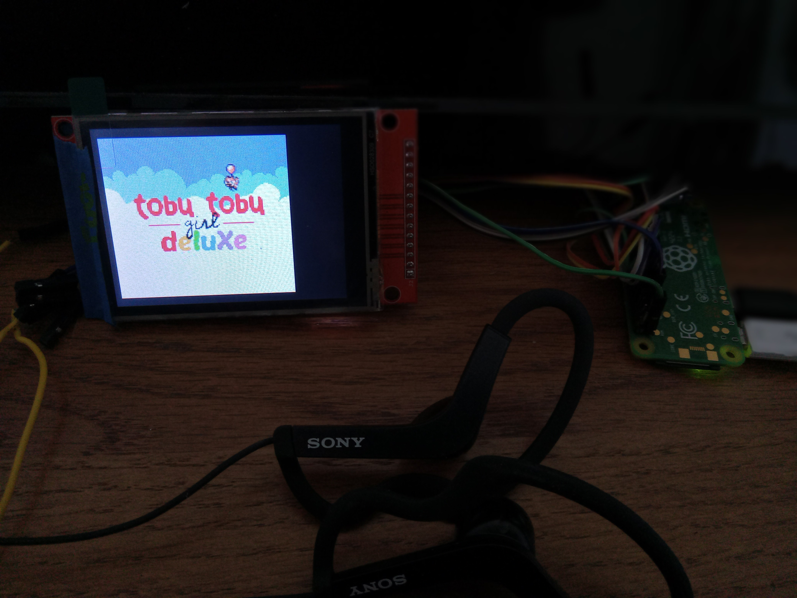
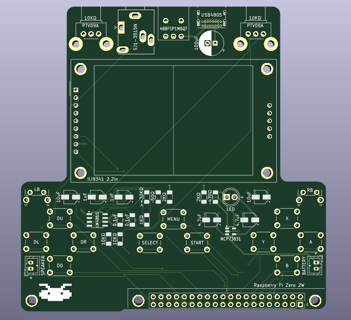
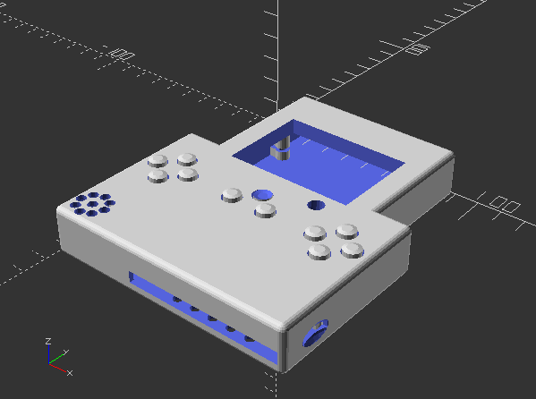

# RPi02W-PeanutGB
<b>Running PeanutGB emulator on a Raspberry Pi Zero 2W</b><br>

<a href="https://github.com/deltabeard/Peanut-GB">Link to Original PeanutGB Repo</a><br>

<b>Purpose:</b><br>
This project is to introduce myself to how the Raspberry Pi Zero 2W works, and further my knowledge on 'modern' microprocessors running Linux.  The immediate goal is to make a handheld device that plays Gameboy and Gameboy Color games that can also connect to the television.  Other goals are to have an NES, SNES, and GBA emulator for this system.  I'm using PeanutGB first because I am familiar with it, and I wanted to port something well-designed, well-tested, and that would have no problem running on this device.<br>

<b>Connecting an ILI9341 LCD in SPI mode using pins:</b><br>
CS = GPIO8 / Pin24<br>
MISO = GPIO9 / Pin21<br>
MOSI = GPIO10 / Pin19<br>
SCLK = GPIO11 / Pin23<br>
RESET = GPIO0 / Pin27<br>
DC = GPIO1 / Pin28<br>
LED is connected to 3V3<br>

<b>Connecting a 3.5mm Audio Jack using pins:</b><br>
LEFT = GPIO12 / Pin32<br>
RIGHT = GPIO13 / Pin33<br>

<b>Additional Requirements:</b><br>
You will also need a USB-Micro to USB-A (Female) adapter, and an HDMI-mini to HDMI adapter.<br>

<b>Instructions to Install:</b><br>
1) Re-image an 8GB+ SD Card with Raspberry Pi OS (Lite) 64-bit.<br>
2) Create user named ``` username ``` with pass named ``` password ```.<br>
3) ``` sudo raspi-config ```, change settings in Auto Login to automatically login without password required, as well as booting to Console instead of Desktop.<br>
4) ``` mkdir ~/PeanutGB ```, put all files found here into that folder.<br>
5) ``` mkdir ~/PeanutGB/ROMS ```, put whatever Gameboy and Gameboy Color ROMs into that folder.<br>
6) You can pull the SD Card from the Pi and connect it to another Linux computer to transfer files, use built-in Desktop environment, or some other means.<br>
7) ``` sudo nano /boot/firmware/config.txt ```, and comment out the line ``` #dtoverlay=vc4-kms-v3d ```, the then add these lines to the bottom under ``` [all] ```:
   ```
   dtoverlay=vc4-fkms-v3d
   hdmi_group=1
   hdmi_mode=1
   hdmi_drive=2
   max_framebuffers=2
   enable_tvout=0
   dtparam=spi=on
   dtoverlay=fbtft,spi0-0,ili9341,bgr,rotate=270,speed=50000000,dc_pin=1,reset_pin=0,framebuffer_width=320,framebuffer_height=240
   dtoverlay=audremap,pins_12_13
   audio_pwm_mode=2
   disable_audio_dither
   ```
8) ``` sudo nano /boot/firmware/cmdline.txt ```, then add to the end of the first line:
   ```
   video=HDMI-A-1:640x480M@60,margin_top=20,margin_bottom=20,margin_left=20,margin_right=20
   ```
9) ``` sudo nano /etc/rc.local ```, and if file already exists, just add ``` sudo modprobe snd-pcm-oss ```.  Else, add these lines to the file:
   ```
   #!/bin/sh
   sudo modprobe snd-pcm-oss
   exit 0
   ```
8) ``` sudo chmod +rwx /etc/rc.local ; sudo chown root /etc/rc.local ``` to give permissions to file.<br>
9) ``` sudo reboot ``` for changes to take effect.<br>
10) ``` sh ~/PeanutGB/install.sh ```, to compile all C files.<br>
11) To run: ``` sh ~/PeanutGB/run.sh ```, or to auto run on boot: ``` echo 'sh ~/PeanutGB/run.sh' >> ~/.bashrc ```.<br>

<b>Features:</b><br>
- The PeanutGB emulator used is actually a version by 'froggestspirit', found <a href="https://github.com/froggestspirit/Peanut-GB">here</a>, in order to play Gameboy Color games.<br>
- If HDMI is plugged in on boot, games will be played through HDMI.  Else, games will be played through LCD.<br>
- It can use a USB keyboard, or an Xbox360 style USB controller.<br>
- PeanutGB emulator has fast-forward button, turbo buttons, and save/load RAM to external file.<br>
- All files here are compiled using ``` gcc ``` and only uses standard Linux libraries.<br>
- In order to draw to the screen, PeanutGB will write directly to ``` /dev/fb0 ```.<br>
- In order to get keyboard events, PeanutGB will read directly from ``` /dev/input/event0 ```.<br>
- In order to send audio data, PeanutGB will stream directly to ``` /dev/dsp ```.<br>
- Warning: ``` /dev/dsp ``` is only available after ``` sudo modprobe snd-pcm-oss ```.<br>

<b>NES, SNES, and GBA Emulator Development:</b><br>
- PICnes is my own NES emulator that was previously made for the PIC32MZ, initial code found <a href="https://github.com/stevenchadburrow/AcolyteHandheld">here</a>.<br>
- LakeSnes is an SNES emulator, found <a href="https://github.com/dinkc64/LakeSnes">here</a>.  I got it to run on the Pi, but it is far too slow at the moment.<br>
- gdkGBA is a public domain GBA emulator, found <a href="https://github.com/gdkchan/gdkGBA">here</a>.  It runs well enough at 20 FPS, though it does have graphical glitches in some games.  I'm using Normmatt's open-source BIOS, hosted by Nebuleon <a href="https://github.com/Nebuleon/ReGBA/">here</a>.<br>

<b>Videos:</b><br>
<a href="https://youtube.com/shorts/ARCSKjPH7FA?si=rqlXaKl9zKCdxzBo">Youtube Short of me playing Tobu Tobu Girl DX</a><br>

<b>Pictures:</b><br>
<br>
<br>
<br>
<br>


